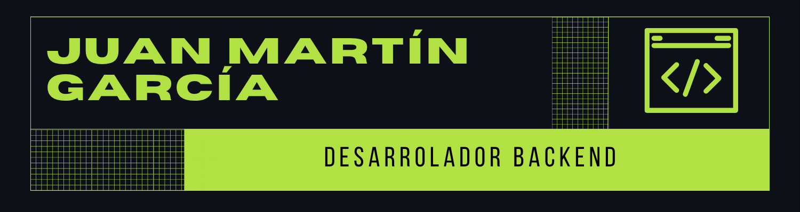

<!-- BANNER PRINCIPAL (Corregido) -->

  

  

<!-- SECCIÓN A DOS COLUMNAS -->
<table align="center" border="0" width="100%">
  <tr>
    <td width="60%">
      <h3>👨‍💻 Sobre mí</h3>
      <ul>
        <li>🔭 Actualmente cursando la Tecnicatura en Programación en la <b>UTN Mendoza</b>.</li>
        <li>🌱 Profundizando mis conocimientos en el desarrollo backend con <b>Java y Python</b>.</li>
        <li>⚙️ Apasionado por la construcción de arquitecturas sólidas y la gestión eficiente de datos.</li>
        <li>💬 Pregúntame sobre <b>Spring Boot, SQL o lógica de programación</b>.</li>
        <li>⚡ Dato curioso: Mi máxima productividad programando siempre llega en los días fríos y nublados con un buen café.</li>
      </ul>
    </td>
    <td width="40%" align="center">
      <!-- Ilustración animada -->
      
    </td>
  </tr>
</table>
